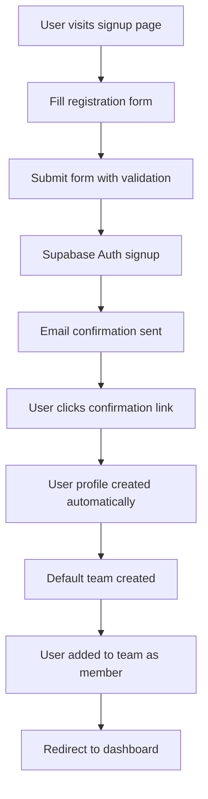
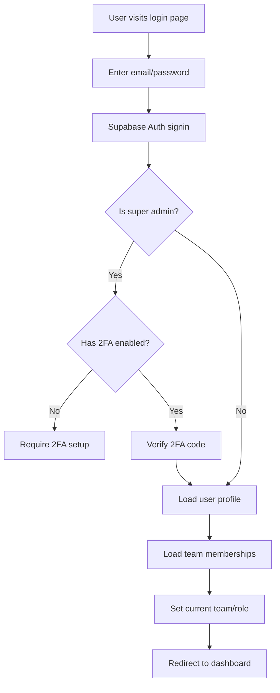
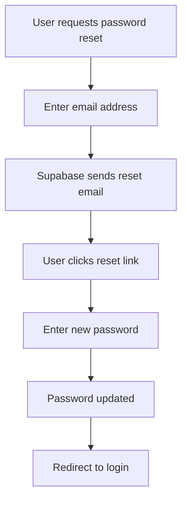

# Authentication & RBAC System Documentation

This document describes the comprehensive authentication and role-based access control (RBAC) system implemented for the Makerly SaaS platform.

## Overview

The authentication system provides:
- **Email/password authentication** with Supabase Auth
- **Email confirmation flow** for new user signups
- **Password reset functionality** via email
- **Two-factor authentication (2FA)** for super admin users
- **Role-based access control** with hierarchical permissions
- **Multi-tenant team management** with automatic team creation
- **Comprehensive audit logging** for all user actions

## Authentication Flow

### 1. User Registration



### 2. User Login



### 3. Password Reset



## Database Schema

### Core Tables

#### Users Table (`users`)
- Extends Supabase `auth.users` with custom profile fields
- Includes I18N configuration (timezone, locale, currency, etc.)
- Automatically created via database triggers

#### Teams Table (`teams`)
- Multi-tenant team management
- I18N configuration at team level
- Automatic team creation for new users

#### Team Members Table (`team_members`)
- Many-to-many relationship between users and teams
- Role assignment and status tracking
- Optimistic locking for concurrent updates

#### Roles Table (`roles`)
- Custom role definitions
- System roles (super_admin, admin, member, viewer)
- Custom team-specific roles

#### Permissions Table (`permissions`)
- Action/Resource/Location scoping
- Granular permission definitions
- System-level permission management

#### Role Permissions Table (`role_permissions`)
- Many-to-many relationship between roles and permissions
- Dynamic permission assignment

## Authentication Composables

### 1. `useAuth` Composable

**Location:** `web/composables/useAuth.ts`

**Features:**
- User session management
- Profile loading and updates
- Team membership management
- Authentication methods (sign in, sign up, sign out)
- Password management

**Usage:**
```vue
<script setup>
const { 
  user, 
  session, 
  profile, 
  teams, 
  currentTeam, 
  currentRole,
  isAuthenticated,
  isSuperAdmin,
  isTeamAdmin,
  signIn,
  signUp,
  signOut,
  resetPassword,
  updatePassword,
  switchTeam
} = useAuth()
</script>
```

**Methods:**
- `signIn(email, password)` - Sign in with email/password
- `signUp(email, password, metadata)` - Create new account
- `signOut()` - Sign out current user
- `resetPassword(email)` - Send password reset email
- `updatePassword(password)` - Update user password
- `switchTeam(teamId)` - Switch to different team
- `loadUserProfile()` - Reload user profile
- `loadUserTeams()` - Reload user teams

### 2. `useRBAC` Composable

**Location:** `web/composables/useRBAC.ts`

**Features:**
- Permission checking with database queries
- Role-based access control
- Hierarchical permission system
- Resource-specific permission checks

**Usage:**
```vue
<script setup>
const { 
  hasPermission,
  can,
  canCreate,
  canRead,
  canUpdate,
  canDelete,
  canManageTeamMembers,
  canManageRoles,
  belongsToTeam,
  isAdminOfTeam
} = useRBAC()

// Check specific permission
const canManageUsers = await can('update', 'user', 'team')

// Check resource permissions
const canCreateInventory = await canCreate('inventory', 'team')
</script>
```

### 3. `use2FA` Composable

**Location:** `web/composables/use2FA.ts`

**Features:**
- TOTP (Time-based One-Time Password) management
- QR code generation for authenticator apps
- Factor enrollment and verification
- Super admin 2FA enforcement

**Usage:**
```vue
<script setup>
const { 
  loading, 
  error, 
  factors, 
  hasTOTP, 
  getQRCodeData,
  enrollTOTP, 
  verifyTOTP, 
  unenrollFactor 
} = use2FA()

// Enroll in TOTP
await enrollTOTP('My Authenticator')

// Verify TOTP code
await verifyTOTP(factorId, '123456')
</script>
```

## API Routes

### Authentication API (`/api/auth/[...path]`)

**Location:** `web/server/api/auth/[...path].ts`

**Endpoints:**
- `POST /api/auth/login` - User login
- `POST /api/auth/signup` - User registration
- `POST /api/auth/logout` - User logout
- `POST /api/auth/reset-password` - Password reset request
- `POST /api/auth/update-password` - Password update
- `POST /api/auth/mfa/enroll` - Enroll in 2FA
- `POST /api/auth/mfa/verify` - Verify 2FA code
- `DELETE /api/auth/mfa/unenroll` - Remove 2FA factor
- `GET /api/auth/mfa/factors` - List MFA factors

**Request/Response Examples:**

**Login:**
```typescript
// Request
POST /api/auth/login
{
  "email": "user@example.com",
  "password": "password123"
}

// Response
{
  "success": true,
  "data": {
    "user": { /* Supabase user object */ },
    "session": { /* Supabase session object */ }
  }
}
```

**Signup:**
```typescript
// Request
POST /api/auth/signup
{
  "email": "user@example.com",
  "password": "password123",
  "firstName": "John",
  "lastName": "Doe",
  "acceptTerms": true
}

// Response
{
  "success": true,
  "data": {
    "user": { /* Supabase user object */ },
    "session": { /* Supabase session object */ }
  },
  "message": "Account created successfully. Please check your email to confirm your account."
}
```

## Authentication Pages

### 1. Login Page (`/auth/login`)

**Location:** `web/pages/auth/login.vue`

**Features:**
- Email/password authentication
- Remember me functionality
- Password reset link
- Form validation with Zod
- Error handling and success states

### 2. Signup Page (`/auth/signup`)

**Location:** `web/pages/auth/signup.vue`

**Features:**
- User registration with profile creation
- Password confirmation
- Terms acceptance
- Email confirmation flow
- Form validation with Zod

### 3. Password Reset (`/auth/reset-password`)

**Location:** `web/pages/auth/reset-password.vue`

**Features:**
- Email-based password reset
- Success/error states
- Redirect to login after success

### 4. Password Update (`/auth/update-password`)

**Location:** `web/pages/auth/update-password.vue`

**Features:**
- New password entry
- Password confirmation
- Automatic redirect to login

### 5. 2FA Setup (`/settings/2fa`)

**Location:** `web/pages/settings/2fa.vue`

**Features:**
- QR code generation for authenticator apps
- TOTP enrollment and verification
- Factor management
- Super admin requirement enforcement

## Database Triggers

### User Profile Creation

**Function:** `handle_new_user()`
- Automatically creates user profile in `users` table
- Extracts metadata from Supabase Auth
- Sets default I18N preferences

### Default Team Creation

**Function:** `create_default_team_for_user()`
- Creates default team for new users
- Adds user as team member with 'member' role
- Sets team I18N preferences from user preferences

### User Updates

**Function:** `handle_user_update()`
- Updates user profile when auth.users changes
- Maintains data consistency
- Tracks version changes

### User Deletion

**Function:** `handle_user_delete()`
- Soft deletes user profile
- Deactivates team memberships
- Preserves audit trail

## Security Features

### Row-Level Security (RLS)

All database operations are protected by RLS policies:
- **Multi-tenant isolation** - Users can only access their team's data
- **Role-based access** - Permissions enforced at database level
- **Audit protection** - Audit logs are read-only and team-scoped

### Two-Factor Authentication (2FA)

- **TOTP Support** - Time-based One-Time Password via authenticator apps
- **Super Admin Enforcement** - 2FA required for super admin users
- **Factor Management** - Enroll, verify, and remove factors
- **QR Code Generation** - Easy setup with authenticator apps

### Password Security

- **Minimum Length** - 8 characters minimum
- **Supabase Policies** - Enforced by Supabase Auth
- **Secure Reset** - Email-based password reset flow
- **Session Management** - Automatic token refresh

### Permission System

- **Hierarchical Roles** - Super Admin > Team Admin > Member > Viewer
- **Resource Scoping** - Action/Resource/Location permission system
- **Real-time Enforcement** - Changes take effect immediately
- **Database-level Security** - RLS policies enforce permissions

## Middleware

### Authentication Middleware (`auth.ts`)

**Purpose:** Protect routes that require authentication

**Features:**
- Redirects unauthenticated users to login
- Redirects authenticated users away from auth pages
- Defines public routes

**Usage:**
```vue
<script setup>
definePageMeta({
  middleware: 'auth'
})
</script>
```

### Admin Middleware (`admin.ts`)

**Purpose:** Protect admin-only routes

**Features:**
- Checks for admin/super admin privileges
- Validates specific permissions for routes
- Throws 403 errors for unauthorized access

**Usage:**
```vue
<script setup>
definePageMeta({
  middleware: ['auth', 'admin']
})
</script>
```

### Guest Middleware (`guest.ts`)

**Purpose:** Redirect authenticated users away from auth pages

**Usage:**
```vue
<script setup>
definePageMeta({
  middleware: 'guest'
})
</script>
```

## Environment Configuration

### Required Variables

```bash
# Supabase Configuration
SUPABASE_URL=https://your-project.supabase.co
SUPABASE_ANON_KEY=your-anon-key
SUPABASE_SERVICE_ROLE_KEY=your-service-role-key

# Application URLs
NUXT_PUBLIC_APP_URL=http://localhost:3000
```

### Supabase Configuration

**File:** `supabase/config.toml`

**Key Settings:**
- `enable_confirmations = true` - Email confirmation required
- `enable_signup = true` - Allow new user signups
- `minimum_password_length = 6` - Password requirements
- `mfa.totp.enroll_enabled = true` - Enable TOTP 2FA
- `mfa.totp.verify_enabled = true` - Enable TOTP verification

## Testing

### Test Authentication Flow

1. **User Registration**
   - Visit `/auth/signup`
   - Fill registration form
   - Verify email confirmation
   - Check profile creation

2. **User Login**
   - Visit `/auth/login`
   - Enter credentials
   - Verify session establishment
   - Check team loading

3. **Password Reset**
   - Visit `/auth/reset-password`
   - Enter email address
   - Check reset email
   - Verify password update

4. **2FA Setup**
   - Login as super admin
   - Visit `/settings/2fa`
   - Enroll TOTP factor
   - Verify 2FA enforcement

### Test Permission System

1. **Role Assignment**
   - Create different user roles
   - Test permission checks
   - Verify RLS enforcement

2. **Team Management**
   - Test team creation
   - Verify member management
   - Check team switching

## Best Practices

### 1. Always Use Composables

```vue
<!-- Good -->
<script setup>
const { user, isAuthenticated } = useAuth()
const { canCreate } = useRBAC()
</script>

<!-- Avoid direct Supabase client usage -->
<script setup>
const supabase = useSupabaseClient()
// Direct usage without composables
</script>
```

### 2. Check Permissions Before Operations

```vue
<script setup>
const { canCreate } = useRBAC()

const handleCreate = async () => {
  if (!(await canCreate('inventory', 'team'))) {
    throw new Error('Permission denied')
  }
  // Proceed with creation
}
</script>
```

### 3. Use Middleware for Route Protection

```vue
<script setup>
definePageMeta({
  middleware: ['auth', 'admin']
})
</script>
```

### 4. Handle Loading States

```vue
<template>
  <div v-if="loading">Loading...</div>
  <div v-else-if="error">Error: {{ error.message }}</div>
  <div v-else>Content loaded</div>
</template>
```

### 5. Implement 2FA for Super Admins

```vue
<script setup>
const { isSuperAdmin, hasTOTP } = useAuth()
const { is2FARequired } = use2FA()

// Redirect to 2FA setup if required
if (isSuperAdmin.value && is2FARequired.value) {
  navigateTo('/settings/2fa')
}
</script>
```

## Troubleshooting

### Common Issues

1. **"Permission denied" errors**
   - Check RLS policies are active
   - Verify user has required role
   - Ensure team membership is active

2. **Authentication not working**
   - Check environment variables
   - Verify Supabase project configuration
   - Check redirect URLs

3. **2FA not working**
   - Verify MFA is enabled in Supabase config
   - Check factor enrollment status
   - Verify TOTP code format

4. **Email confirmation not working**
   - Check SMTP configuration
   - Verify email templates
   - Check spam folder

### Debugging

```typescript
// Check current user context
const { user, currentTeam, currentRole } = useAuth()

// Check permissions
const { getAllPermissions } = useRBAC()
const permissions = await getAllPermissions()

// Check 2FA status
const { hasTOTP, factors } = use2FA()
console.log('2FA enabled:', hasTOTP.value)
console.log('Active factors:', factors.value)
```

## Security Considerations

### 1. Super Admin Protection

- **2FA Enforcement** - Super admins must enable 2FA
- **Database Triggers** - Prevent login without 2FA
- **Role Validation** - Verify super admin status

### 2. Session Security

- **Token Refresh** - Automatic session renewal
- **Secure Storage** - HttpOnly cookies for sessions
- **Logout Handling** - Proper session cleanup

### 3. Password Security

- **Minimum Requirements** - Enforced by Supabase
- **Reset Flow** - Secure email-based reset
- **Update Validation** - Confirm password changes

### 4. Audit Trail

- **User Actions** - Track all authentication events
- **Permission Changes** - Log role modifications
- **Security Events** - Monitor failed logins

The authentication and RBAC system provides enterprise-grade security with comprehensive user management, role-based access control, and multi-factor authentication for the Makerly SaaS platform.
